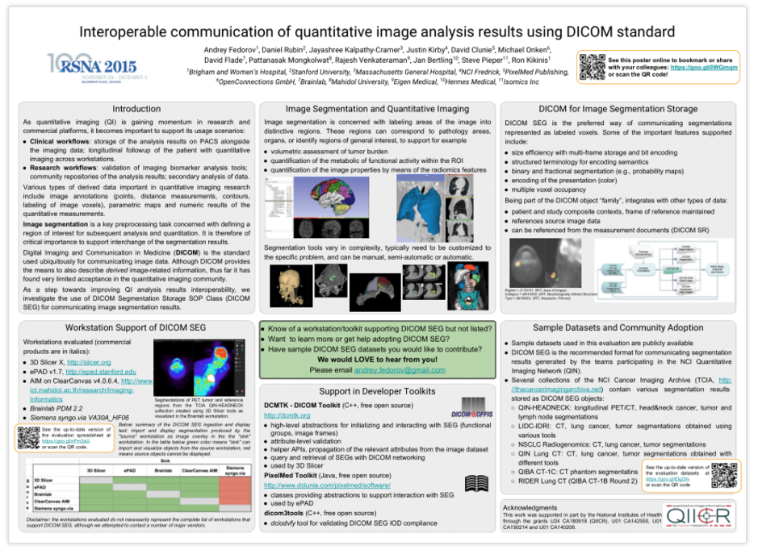
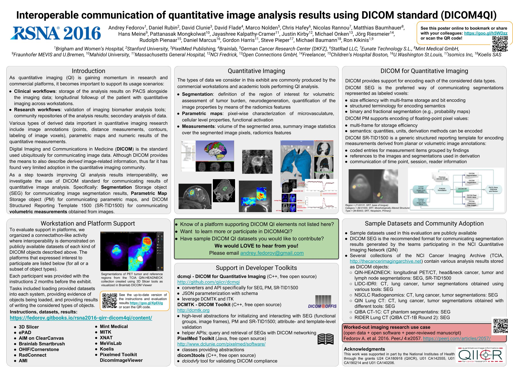

# Summary

DICOM4QI is an open connectathon with the purpose of evaluating interoperability of the image analysis tools and workstations, applied to exchange of the quantitative image analysis results using DICOM standard.

DICOM4QI welcomes participation of the relevant tools independent of their origin (academic or commercial, open-source or not). The only requirement is to comply with the rules. Feedback on the formulation of the rules is welcomed from the participants!

For the past 2 years, DICOM4QI results have been presented at the Annual meeting of the Radiological Society of North America (RSNA).  

The present document was created to help with the organization of the exhibit activity, and as such serves two purposes:
* First, this is the place to develop and document operating procedures, expectations and organize test datasets.
* Second, this document will be used to report the connectathon results.

# History

In 2015, [Andrey Fedorov](http://fedorov.github.io) and [Daniel Rubin](https://med.stanford.edu/profiles/daniel-rubin) came up with an idea of a collaborative project with the goal of testing and improving [DICOM](http://dicom.nema.org/Dicom/about-DICOM.html) interoperability for communicating [quantitative image analysis results](https://peerj.com/articles/2057/) (so called, "DICOM-QI connectathon"). This led to a Quantitative Imaging Reading Room (QIRR) exhibit at the annual convention of the [Radiological Society of North America (RSNA)](http://rsna.org) in 2015. The goal of that exhibit was to demonstrate DICOM-based communication of the image segmentation results. You can see the summary of the exhibit results in [this poster](https://dx.doi.org/10.6084/m9.figshare.1619877.v1).

In 2016, a larger group assembled aiming to continue and expand the scope of the original 2015 RSNA/QIRR DICOM for Quantitative Imaging (DICOM4QI) connectathon. Following successful application for participation, RSNA 2016 QIRR will feature the new iteration of the connectathon.

# References

* Fedorov A, Clunie D, Ulrich E, Bauer C, Wahle A, Brown B, Onken M, Riesmeier J, Pieper S, Kikinis R, Buatti J, Beichel RR. (2016) DICOM for quantitative imaging biomarker development: a standards based approach to sharing clinical data and structured PET/CT analysis results in head and neck cancer research. PeerJ 4:e2057 https://doi.org/10.7717/peerj.2057
